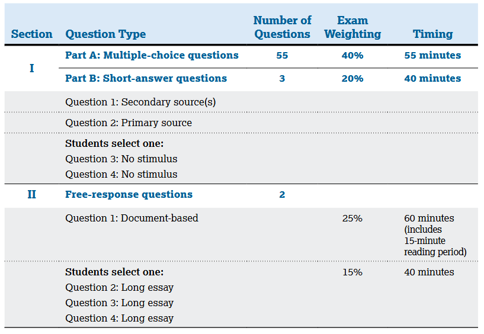

# Format

[Source](https://apcentral.collegeboard.org/media/pdf/ap-world-history-modern-course-and-exam-description.pdf)

## Overview

3 hours and 15 minutes total, 55 MCQ (55min), 3 SAQ (40min / 13min per), 1 DBQ (60 min), and 1 LEQ (40 min)

Themes:

- Humans and the Environment
- Cultural Developments and Interactions
- Governance
- Economic Systems
- Social Interactions and Organization
- Technology and Innovatio

## Section 1

### PART A: MULTIPLE-CHOICE

The first part of Section 1 of the AP World History Exam includes 55 multiple-choice questions typically appearing in sets of three to four questions, each with one or more stimuli, including primary texts, secondary texts, images (artwork, photos, posters, cartoons, etc.), charts or other quantitative data, and maps. Additionally, there will be at least one set of paired text-based stimuli. Multiple-choice questions require analysis of the provided stimulus sources and of the historical developments and processes described in the sources.

### PART B: SHORT-ANSWER

The second part of Section 1 of the AP Exam also includes three required short-answer questions. Short-answer question 1 is required and includes a secondary source stimulus. The topic of the question will include historical developments or processes between the years 1200 and 2001.

Short-answer question 2 is required and includes a primary source stimulus. The topic of the question will include historical developments or processes between the years 1200 and 2001.

Students may select short-answer questions 3 or 4, neither of which includes a stimulus. Short-answer question 3 will focus on historical developments or processes between the years 1200 and 1750. Short-answer question 4 will focus on historical developments or processes between the years 1750 and 2001.

All four historical periods are represented among the four short-answer questions.

## Section 2

### DOCUMENT-BASED QUESTION

The document-based question presents students with seven documents offering various perspectives on a historical development or process. The question requires students to do the following:

- Respond to the prompt with a historically defensible thesis or claim that establishes a line of reasoning.
- Describe a broader historical context relevant to the prompt.
- Support an argument in response to the prompt using at least four documents.
- Use at least one additional piece of specific historical evidence (beyond that found in the documents) relevant to an argument about the prompt.
- For at least two documents, explain how or why the document’s point of view, purpose, historical situation, and/or audience is relevant to an argument.
- Demonstrate a complex understanding of a historical development related to the prompt through sophisticated argumentation and/or effective use of evidence.

The topic of the document-based question will include historical developments or processes between the years 1450 and 2001.

### LONG ESSAY QUESTION

The long essay question requires students to do the following:

- Respond to the prompt with a historically defensible thesis or claim that establishes a line of reasoning.
- Describe a broader historical context relevant to the prompt.
- Support an argument in response to the prompt using at least two pieces of specific and relevant evidence.
- Use historical reasoning (e.g., comparison, causation, continuity or change over time) to frame or structure an argument that addresses the prompt.
- Demonstrate a complex understanding of a historical development related to the prompt through sophisticated argumentation and/or effective use of evidence.

Students must select one of the three long essay questions. Each question focuses on the same reasoning process, but historical developments and processes in different time periods. The first option focuses primarily on historical developments or processes between 1200 and 1750, the second primarily on historical developments or processes between 1450 and 1900, and the third primarily on historical developments or processes between 1750 and 2001.
